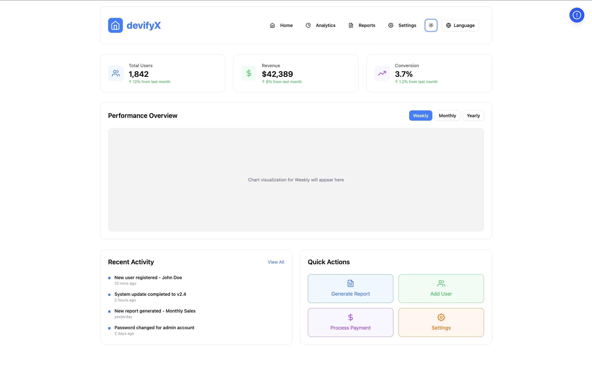
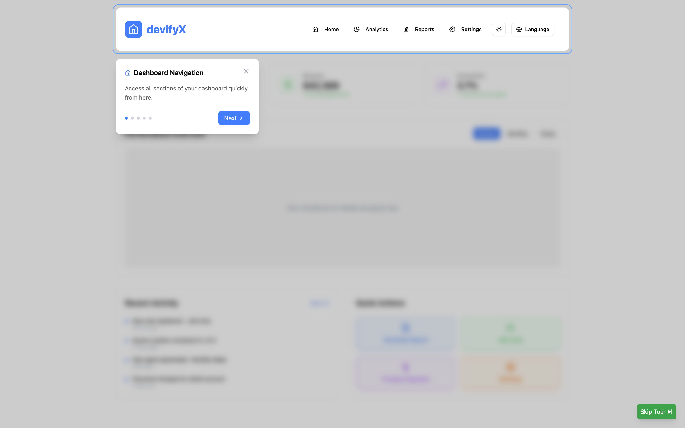
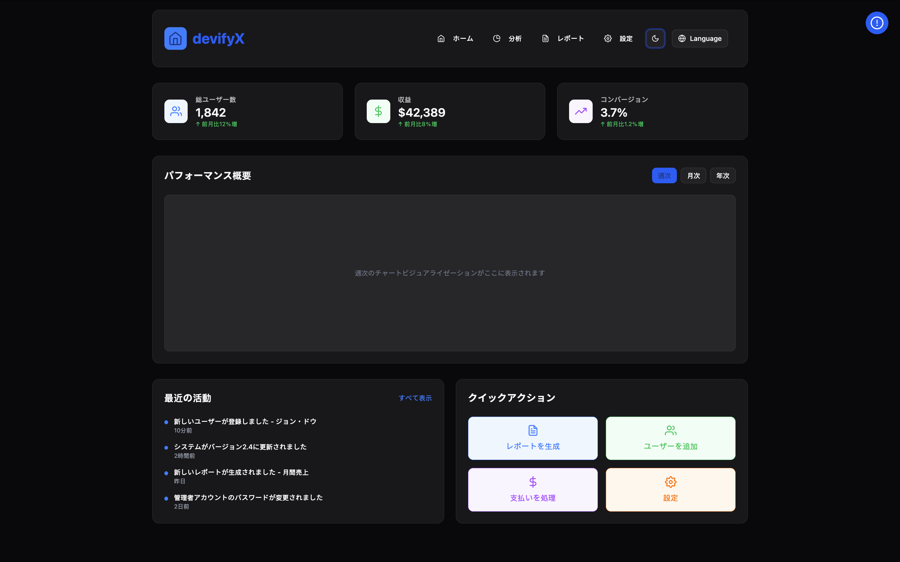

# 🌟 User Onboarding Application

A **React application** that simulates user onboarding by walking users through the app’s core features with interactive highlights and contextual tooltips.

---

## ✨ Features

* 🎨 **Theme Support**: Light and Dark mode
* 🌐 **Multi-language Support**: English, Hindi, Japanese, French
* 📱 **Responsive Design**: Optimized for mobile and desktop
* 💾 **Persistent State**: Uses `localStorage` to track if the user has completed onboarding
* 🧭 **Interactive Tooltips**:

  * Includes **Next**, **Back** buttons
  * Shows **Progress Indicator**
* 🔁 **Restart Tour** and **Skip Tour** functionality
* 🎞️ **Smooth Transitions** throughout the experience

---

## 🚀 How to Run

```bash
# Clone the repository
git clone https://github.com/Nikeshchaudhary52494/devifyx_onboarding_application

# Navigate into the project directory
cd devifyx_onboarding_application

# Install dependencies
npm install

# Run the application
npm run dev
```

---

## 🛠️ Technology Used

* [React](https://reactjs.org/)
* [ShadCN UI](https://ui.shadcn.dev/)
* [Tailwind CSS](https://tailwindcss.com/)
* [i18next](https://www.i18next.com/) for internationalization

---

## 🔍 Preview

1. 💡 Light Mode Dashboard
   

2. 🧭 Ongoing Tour with Tooltip
   

3. 🌙 Dark Mode with Japanese Language
   

